```mermaid
flowchart TD
    %% =========== SESSION 1 ===========
    subgraph S1["SESSION 1 — Travelogue plus Day One peacetime — 3.5 hrs"]
        direction TD
        S1A["Travelogue · ~30–40 min<br/>8 episodes · Mirabar → Goldenfields →<br/>Triboar · Eldred + Kestler Bahamut →<br/>Waterdeep shopping arc → Daggerford ⭐ silent child →<br/>Beregost → Way of the Lion"]
        S1A --> S1B["Emerald Door<br/>Bookwyrm receives 5 books<br/>First Reader allocates scholars"]
        S1B --> S1Choice1{{"Polly Pocket?<br/>Bell Tower / Keep in bag / Release"}}
        S1Choice1 --> S1C["Refectory dinner<br/>⭐ ONLY time party sees Janussi alive<br/>Daral drunk · Sylvira ill · A'lai and Alkrist whispering"]
        S1C --> S1D["Parallel scholar lanes · interleave<br/>Daz-Yvenne · Zalthir-Khell-Vire and Kenshi<br/>Thorin-Philemon · Grygum-Vareth"]
        S1D --> S1E["Sylvira / Infernal Fortress<br/>demon-lord evidence handoff<br/>★ ally before suspect"]
        S1E --> S1F["⭐ Plant: Endless Chant Deadwinter Prophecy snippet<br/>⭐ Plant: hooded corridor figure — A'lai with the gift"]
        S1F --> S1G["Glabbagool's question<br/>Pavilion / Tales / ⭐ Whispering Dome boon"]
        S1G --> S1Cliff1["🟡 CLIFFHANGER<br/>Fembris pounds the inn door<br/>'The Keeper of Tomes is dead'"]
    end

    S1Cliff1 ==> S2A

    %% =========== SESSION 2 ===========
    subgraph S2["SESSION 2 — Frosty Reception plus Crime Scene — 3 hrs"]
        direction TD
        S2A["Endless Chant continues<br/>⭐ '...the many-faced man · his metal hand pulling strings'"]
        S2A --> S2B["Chapter House<br/>Bookwyrm conscripts party<br/>removes Kalan from the case"]
        S2B --> S2C["Kalan corridor approach<br/>'find me at Sea Warden's<br/>if you need a key turned'"]
        S2C --> S2D["Janussi's chamber · crime scene"]
        S2D --> S2E["Body · heart hacked POST-MORTEM<br/>no defensive wounds<br/>⭐ poison was the killer · cleaver was ritual"]
        S2E --> S2F["Open book · The Golden Ass<br/>DC 15 Investigation: midnight tears<br/>DC 18: he died from contact"]
        S2F --> S2G["Magic-missile chair · ⭐ unknown attacker<br/>Safe blasted by knock spell · sapphire missing<br/>⭐ Appointment book: every Reader visited yesterday"]
        S2G --> S2H["⭐ Lead chain links on floor<br/>HTL key was in a lead locket · gone"]
        S2H --> S2I["Miss Hollypocket and Queenie<br/>⭐ Sylvira at 1 am · cat hissed for first time<br/>⭐ A'lai at dawn before body found"]
        S2I --> S2J["Tadric the Watcher<br/>⭐ Saw BOOKWYRM in corridor 1:30 am<br/>— she should have been asleep"]
        S2J --> S2K["Investigators' Office<br/>walking-permit medallions · Fembris attaches"]
        S2K --> S2Cliff2["🟡 CLIFFHANGER<br/>Kalan privately gives ONE PC<br/>⭐ the SECOND High Tower key"]
    end

    S2Cliff2 ==> S3A

    %% =========== SESSION 3 ===========
    subgraph S3["SESSION 3 — Every Reader Hides a Secret · Part 1 — 3 hrs"]
        direction TD
        S3A["Atmosphere · glass swept<br/>chant fragments harder · Daz's pressure ↑<br/>⭐ Acolyte Marin · 6-pointed quill star"]
        S3A --> S3B["Southern Dining Hall search<br/>⭐ heart and cleaver in LEAD chalice on Milil statue<br/>lead defeats divination — killer knew the spell library"]
        S3B --> S3C["Speak with Dead FAILS on the heart<br/>⭐ the FAILURE is the clue<br/>— someone cast it FIRST to lock the corpse"]
        S3C --> S3D["Reader interviews · pick order"]

        S3D --> S3E["Sylvira · Infernal Fortress<br/>visibly plague-ill<br/>⭐ Moziqodo bite plus son disclosure<br/>— Janussi gave her 10 days"]
        S3D --> S3F["Daral · Bath House"]
        S3D --> S3G["Fheminor · Founder's Court<br/>if earned trust<br/>⭐ 'Bookwyrm was not surprised'<br/>plus Janussi was naming HER successor"]

        S3F --> S3Choice2{{"Save Daral?<br/>DC 14 Medicine spot<br/>· lesser restoration"}}
        S3Choice2 -->|saved| S3F2["Daral lives →<br/>★ key witness Session 5"]
        S3Choice2 -->|let die| S3F3["Daral dies overnight ·<br/>module-canon path"]

        S3E --> S3H["Scholar interleaves · 2 of 4"]
        S3F2 --> S3H
        S3F3 --> S3H
        S3G --> S3H

        S3H --> S3I["Thorin-Philemon Phase 2<br/>scabbard pivot · 🟣 PATH A/B/C choice"]
        S3H --> S3J["Daz-Yvenne<br/>⭐ Vaelissa T'sarran name lands<br/>⭐ Bell Tower deadline for Polly · Kalan alive today"]

        S3I --> S3End["Optional cliffhanger:<br/>⭐ rooftop silhouette across Cursed Tower<br/>— Moziqodo · don't explain"]
        S3J --> S3End
    end

    %% styling
    classDef cliff fill:#fef3c7,stroke:#d97706,stroke-width:3px,color:#000
    classDef choice fill:#fce7f3,stroke:#db2777,stroke-width:2px,color:#000
    classDef clue fill:#dbeafe,stroke:#2563eb,stroke-width:2px,color:#000
    classDef session fill:#f3f4f6,stroke:#374151,stroke-width:2px

    class S1Cliff1,S2Cliff2,S3End cliff
    class S1Choice1,S3Choice2,S3I choice
    class S1C,S1E,S1F,S2H,S2I,S2J,S2Cliff2,S3B,S3C,S3G,S3J clue
```

# Candlekeep arc — flowchart (Sessions 1–3)

Visual sequencer for the next three sessions of the Candlekeep
Murders arc. Renders natively on GitHub, VS Code (with mermaid
plugin), Obsidian, or paste into <https://mermaid.live>.

**Companion files:**
- `notes/sessions/blingdenstone_to_candlekeep_travelogue.md` — Session 1 prelude
- `notes/sessions/candlekeep_day_one.md` — Session 1 main
- `notes/sessions/candlekeep_murders_arc.md` — full 8-session plan

**Legend:**
- 🟡 yellow = end-of-session **cliffhanger**
- 🔵 blue = **key clue or item to plant explicitly**
- 🟣 pink = **player choice** with downstream impact
- ⭐ star prefix in node text = item the GM should not let pass without naming it

---

---

## Compact session-end checklist

After each session, confirm these landed:

### Session 1
- [ ] Travelogue ran (or compressed); Daz's somatic field-perception established
- [ ] Polly Pocket disposition decided
- [ ] Party saw Janussi alive at the Refectory
- [ ] Endless Chant Deadwinter Prophecy snippet planted
- [ ] Hooded corridor figure (A'lai) glimpsed
- [ ] Sylvira accepted demon-lord evidence (ally locked in before suspicion)
- [ ] Glabbagool's question landed (Whispering Dome boon banked if applicable)
- [ ] Fembris cliffhanger delivered

### Session 2
- [ ] Bookwyrm publicly removed Kalan from the case
- [ ] Kalan offered himself as covert ally
- [ ] Crime scene: poison identified, lead chain links found, magic-missile chair noted, sapphire-theft logged
- [ ] Hollypocket testimony (Sylvira at 1 am + Queenie hissed + A'lai at dawn)
- [ ] Tadric testimony (Bookwyrm at 1:30 am)
- [ ] Investigators' Office assigned, permanent medallions issued
- [ ] **One PC explicitly received the second High Tower key from Kalan**

### Session 3
- [ ] Heart + cleaver found in the lead chalice
- [ ] `Speak with Dead` failed on the heart (player tried, GM let it fail)
- [ ] Sylvira's plague disclosed; party knows Moziqodo exists
- [ ] **Daral saved or dead** — note the choice
- [ ] Fheminor delivered "Bookwyrm was not surprised"
- [ ] Thorin's Path A/B/C declared (scabbard pivot resolved)
- [ ] Yvenne landed the Vaelissa T'sarran name
- [ ] Polly Pocket decision revisited if Bell Tower option was on the table
- [ ] Rooftop Moziqodo silhouette planted (optional)

---

## Beyond Session 3 (one-line preview)

- **Session 4:** finish Reader interviews (A'lai, Alkrist, Teles, Kazryn, Bookwyrm) + physical evidence (Apothecary, Kitchens, Outfitters) → Fembris breaks at Bell Tower → milestone level-up to **9**
- **Session 5:** Day Two morning — Daral status, Kalan missing, Pont de Paramours, **three converging paths** (Alkrist arrest / Sylvira ally / Cursed Tower direct) → Bookwyrm dead at session end
- **Session 6:** climax — High Tower fight (A'lai + Moziqodo), wards drop hallucination, A'lai escapes, Manshoon arrives below
- **Session 7:** cryptogram race across the keep → House of Alaundo → lava chamber → Manshoon already inside
- **Session 8:** Vault, Echoes of Alaundo (4 OOTA-load-bearing prophecies including Eldeth's Gauntlgrym call), Manshoon escapes, Eldeth's letter
