```mermaid
flowchart TD
    %% =========== SESSION 1 ===========
    subgraph S1["SESSION 1 — Travelogue plus Day One peacetime — 3.5 hrs"]
        direction TD
        S1A["✅ Travelogue · ~30–40 min<br/>8 episodes · Mirabar → Goldenfields →<br/>Triboar · Eldred + Kestler Bahamut →<br/>Waterdeep shopping arc → Daggerford ⭐ silent child →<br/>Beregost → Way of the Lion"]
        S1A --> S1B["✅ Emerald Door<br/>Bookwyrm receives 5 books<br/>First Reader allocates scholars"]
        S1B --> S1Choice1{{"✅ Polly Pocket?<br/>→ KEPT IN BAG · longer-term still open"}}
        S1Choice1 --> S1Qs["✅ ⭐ FIVE BOOKS · FIVE QUESTIONS<br/>1. Daz: 'Who is following me?'<br/>2. Zalthir: 'Who is Jimjar?'<br/>3. Thorin: 'Help with Dawnbringer · process not product'<br/>(⭐ Path C locked from Waterdeep — name don't elect)<br/>4. Grygum: 'What does Bahamut want from me?'<br/>5. ⭐ Glabbagool (Zalthir-sponsored):<br/>'How do I become a shadow monk?'<br/>★ Avowed quote each Q back when the scene opens"]
        S1Qs --> S1C["✅ Refectory dinner<br/>⭐ ONLY time party sees Janussi alive<br/>Daral drunk · Sylvira ill · A'lai and Alkrist whispering"]
        S1C --> S1D["✅ Parallel scholar lanes · interleave<br/>Daz-Yvenne · Zalthir-Khell-Vire and Kenshi<br/>Thorin-Philemon · Grygum-Vareth"]
        S1D --> S1E["⛔ Sylvira / Infernal Fortress<br/>demon-lord evidence handoff · ★ ally before suspect<br/>— SKIPPED · NEVER MET HER · STILL OWED<br/>(run her interview as FIRST CONTACT)"]
        S1E --> S1F["🔶 ⭐ Endless Chant Deadwinter Prophecy snippet — DONE<br/>⭐ hooded corridor figure — A'lai with the gift — NOT landed"]
        S1F --> S1G["⛔ ⭐ Glabbagool's question — Whispering Dome<br/>Zalthir presents · 1-min solo meditation<br/>OUTCOME: Shadow Apprentice sidekick L8<br/>(Tasha's Warrior chassis · Artificial Chakra 4 Ki)<br/>HEADLINE: Corrosive Embrace (Zalthir-grapple synergy)<br/>— SKIPPED · STILL OWED · handout: handouts/glabbagool_shadow_monk_sidekick.md"]
        S1G --> S1Cliff1["✅ CLIFFHANGER — done<br/>Fembris pounds the inn door<br/>'The Keeper of Tomes is dead'"]
    end

    S1Cliff1 ==> S2A
    S1D -.->|scholars keep working<br/>across days| S2Scholar
    S1D -.->|scholars keep working<br/>across days| S3H

    %% =========== SESSION 2 ===========
    subgraph S2["SESSION 2 — Frosty Reception plus Crime Scene — 3 hrs"]
        direction TD
        S2Scholar["✅ Scholar work continues OFFSTAGE<br/>Yvenne reads · Vareth catalogues<br/>Philemon assesses · Khell-Vire opens his notebook<br/>Players may say 'I checked in this afternoon'<br/>★ Scholars REACT to Janussi's death<br/>(Philemon rattled · Vareth gossips · Yvenne steady)"]
        S2A["⬜ Endless Chant continues<br/>⭐ '...the many-faced man · his metal hand pulling strings'<br/>— Manshoon plant · NOT landed"]
        S2A --> S2B["✅ Chapter House<br/>Bookwyrm conscripts party<br/>removes Kalan from the case"]
        S2B --> S2C["⬜ Kalan corridor approach<br/>'find me at Sea Warden's<br/>if you need a key turned' — UPCOMING (run-sheet)"]
        S2C --> S2D["✅ Janussi's chamber · crime scene"]
        S2D --> S2E["✅ Body · heart hacked POST-MORTEM<br/>no defensive wounds<br/>⭐ poison was the killer · cleaver was ritual"]
        S2E --> S2F["🔶 Open book · The Golden Ass<br/>poison + missing-book established<br/>⭐ 'midnight tears' NOT YET NAMED (Apothecary / library / Daral)"]
        S2F --> S2G["✅ Magic-missile chair · ⭐ unknown attacker<br/>Safe blasted by knock spell · sapphire missing<br/>⭐ every Reader visited yesterday (via Hollypocket)"]
        S2G --> S2H["✅ ⭐ Lead chain links on floor<br/>HTL key was in a lead locket · gone"]
        S2H --> S2I["✅ Miss Hollypocket and Queenie<br/>⭐ wrong-'Sylvira' at night · 2–3am lantern · no scent<br/>⭐ A'lai at dawn · two keys (Kalan holds the other)<br/>━━ 📍 YOU ARE HERE ━━"]
        S2I --> S2J["⬜ Deidran the dawn Watcher<br/>⭐ Greeted BOOKWYRM to the baths at dawn —<br/>she detoured behind Erudite Outfitters<br/>→ bloodstained cloak in the bins<br/>(Teles later deduces the disguise · Tadric = morning timeline only) — UPCOMING"]
        S2J --> S2K["🔶 Investigators' Office<br/>walking-permit access granted ✅ · Fembris attached ✅<br/>(office / medallions not explicitly staged)"]
        S2K --> S2Cliff2["⬜ CLIFFHANGER — NEXT (run-sheet Beat 2)<br/>Kalan privately gives ONE PC<br/>⭐ the SECOND High Tower key"]
    end

    S2Cliff2 ==> S3A

    %% =========== SESSION 3 ===========
    subgraph S3["SESSION 3 — Every Reader Hides a Secret · Part 1 — 3 hrs"]
        direction TD
        S3A["⬜ Atmosphere · glass swept<br/>chant fragments harder · Daz's pressure ↑<br/>⭐ Acolyte Marin · 6-pointed quill star"]
        S3A --> S3B["⬜ Southern Dining Hall search<br/>⭐ heart and cleaver in LEAD chalice on Milil statue<br/>lead defeats divination — killer knew the spell library"]
        S3B --> S3C["⬜ Speak with Dead FAILS on the heart<br/>⭐ the FAILURE is the clue<br/>— someone cast it FIRST to lock the corpse"]
        S3C --> S3D["⬜ Reader interviews · pick order"]

        S3D --> S3E["⬜ Sylvira · Infernal Fortress · FIRST CONTACT (S1E skipped)<br/>visibly plague-ill<br/>⭐ Moziqodo bite plus son disclosure<br/>— Janussi gave her 10 days"]
        S3D --> S3F["⬜ Daral · Bath House"]
        S3D --> S3G["⬜ Fheminor · Founder's Court<br/>if earned trust<br/>⭐ 'Bookwyrm was not surprised'<br/>plus Janussi was naming HER successor"]

        S3F --> S3Choice2{{"⬜ Save Daral?<br/>DC 14 Medicine spot<br/>· lesser restoration"}}
        S3Choice2 -->|saved| S3F2["Daral lives →<br/>★ key witness Session 5"]
        S3Choice2 -->|let die| S3F3["Daral dies overnight ·<br/>module-canon path"]

        S3E --> S3H["⬜ Scholar interleaves · 2 of 4"]
        S3F2 --> S3H
        S3F3 --> S3H
        S3G --> S3H

        S3H --> S3I["⬜ Thorin-Philemon Phase 2 (Phase 1 done Ch.55)<br/>scabbard pivot · ⭐ Path C locked<br/>(Waterdeep ooze-rights stand + orphan run)<br/>name the partnership; don't elect it"]
        S3H --> S3J["⬜ Daz-Yvenne<br/>⭐ Vaelissa T'sarran name lands (NOT yet)<br/>⭐ Bell Tower deadline for Polly · Kalan alive today"]

        S3I --> S3End["⬜ Optional cliffhanger:<br/>⭐ rooftop silhouette across Cursed Tower<br/>— Moziqodo · don't explain"]
        S3J --> S3End
    end

    %% styling
    classDef cliff fill:#fef3c7,stroke:#d97706,stroke-width:3px,color:#000
    classDef choice fill:#fce7f3,stroke:#db2777,stroke-width:2px,color:#000
    classDef clue fill:#dbeafe,stroke:#2563eb,stroke-width:2px,color:#000
    classDef scholar fill:#dcfce7,stroke:#16a34a,stroke-width:2px,color:#000
    classDef session fill:#f3f4f6,stroke:#374151,stroke-width:2px

    class S1Cliff1,S2Cliff2,S3End cliff
    class S1Choice1,S3Choice2,S3I choice
    class S1Qs,S1C,S1E,S1F,S2H,S2I,S2J,S2Cliff2,S3B,S3C,S3G,S3J clue
    class S2Scholar,S1D,S3H scholar
```

# Candlekeep arc — flowchart (Sessions 1–8)

Visual sequencer for the full eight-session Candlekeep Murders arc.
Renders natively on GitHub, VS Code (with mermaid plugin), Obsidian, or
paste into <https://mermaid.live>. **Sessions 1–3** are status-marked
(see *Where we are*); **Sessions 4–8** are all upcoming — no per-node
status marks past the 📍.

**Companion files:**
- `notes/sessions/blingdenstone_to_candlekeep_travelogue.md` — Session 1 prelude
- `notes/sessions/candlekeep_day_one.md` — Session 1 main
- `notes/sessions/candlekeep_murders_arc.md` — full 8-session plan

**Legend:**
- 🟡 yellow = end-of-session **cliffhanger**
- 🔵 blue = **key clue or item to plant explicitly**
- 🟣 pink = **player choice** with downstream impact
- ⭐ star prefix in node text = item the GM should not let pass without naming it
- 🟢 green = **scholar work continuing offstage** (the questions take *days*; scholars work in parallel to the mystery, not after it)

**Two parallel tracks:** the murder mystery is acute (hours);
the scholar arcs are slow (days). Sessions 2–5 run *both
tracks at once.* See `candlekeep_murders_arc.md` *Calendar
overlay* for the day-by-day breakdown.

---

## ▶ WHERE WE ARE (after Ch.57 — updated for Monday)

**Status marks (in nodes + checklist below):** ✅ done · 🔶 partial / not
fully landed · ⛔ **skipped but still owed** · ⬜ upcoming.

**Done:** all of Session 1 (travelogue, five questions, Refectory, scholar
lanes, Fembris cliffhanger) **and** the Session-2 crime scene through
Hollypocket + Queenie. The table is at the **S2 → S3 boundary.**

**📍 Live pickup (Monday):** the party has just been told **Bookwyrm wants
to see them.** That summons is a run-sheet beat
(`candlekeep_monday_runsheet.md`) — *not* a node on this chart; it slots
between **S2I (done)** and **Kalan's key (S2Cliff2, pending).**

**⛔ Two Session-1 beats were SKIPPED and are still owed:**
- **S1E — the party never met Sylvira.** She is currently a *pure suspect*,
  not the pre-recruited ally the arc assumed. *"Ally before suspect" is
  gone* — run her interview as **first contact.**
- **S1G — Glabbagool's Whispering Dome scene never ran.** His question and
  the Shadow-Apprentice sidekick handoff are unresolved.

**🔶 Not fully landed:** poison is known but **"midnight tears" is not yet
named** (S2F); the **Manshoon chant plant** (S2A) and **hooded-figure
plant** (S1F) haven't been delivered.

**⬜ Next live beats:** Bookwyrm summons → **Kalan's key** (S2Cliff2) →
heart-in-chalice (S3B) → **Reader interviews** (S3D–G) → Daz/Yvenne
Vaelissa + Polly Pocket (S3J).

---

---

## Sessions 4–8 — flowchart

The back half: the killer outruns the party, the keep's wards fail,
Manshoon arrives for the Book, and the Echoes of Alaundo pay off the OOTA
threads. (All upcoming — same legend as above.)

```mermaid
flowchart TD
    %% =========== SESSION 4 ===========
    subgraph S4["SESSION 4 — Every Reader Hides a Secret · Part 2 — milestone to 9"]
        direction TD
        S4A["Atmosphere · ⭐ Acolyte Marin 6-pointed star<br/>'the only shape that holds' · chant stops mid-line"]
        S4A --> S4Split{{"Two tracks · split or rotate"}}
        S4Split --> S4TrackA["Track A · Reader interviews"]
        S4Split --> S4TrackB["Track B · physical evidence"]
        S4TrackA --> S4Alai["A'lai · rehearsed (DC16 Insight) · peppermint<br/>10 days for stolen tomes (Manshoon's man)<br/>dawn key-hunt → stole the sapphire · Iron Bands of Bilarro<br/>⭐ uncertain at the magic-missile chair (not his fight)"]
        S4TrackA --> S4Alkrist["⭐ Alkrist · Drakonoikos · bronze · THE MURDERER (don't tell)<br/>poisoned the book w/ midnight tears · stopped Fheminor's succession<br/>'my aunt has eaten my crime' · doesn't know re: heart/key"]
        S4TrackA --> S4Teles["Teles · lantern-'Sylvira' near Keeper's tower 2am<br/>deduced the disguise → blackmail (DC18 / earned)"]
        S4TrackA --> S4Kazryn["Kazryn · A'lai's lover<br/>⭐ breaks A'lai's 'alone all night' alibi"]
        S4TrackA --> S4Book["Bookwyrm · doesn't break · jaw-muscle at the disguise clue<br/>compliment-as-warning · tries to redirect to Sylvira"]
        S4TrackB --> S4Apo["Apothecary · Leuwin + Nibbles<br/>⭐ midnight tears vial missing<br/>⭐ 'bronze lizardskin' = Alkrist · A'lai + peppermint"]
        S4TrackB --> S4Kit["Kitchens · Sprig · 'Sylvira' took a cleaver ~1am"]
        S4TrackB --> S4Out["Outfitters · bins<br/>⭐ bloodstained cloak = Bookwyrm's silver stitching"]
        S4Split --> S4Sch["🟢 Scholar interleaves<br/>Zalthir Broken Mirror + Pont de Paramours<br/>Grygum Stations 5–8 + Drakonoikos · Thorin Phase 3 Quiet Hour"]
        S4Sch --> S4Kalan["Kalan goodbye · Sea Warden's Tower<br/>'the being in Lost Lore wears another voice'<br/>refuses healing · 'Tadric is the vessel'"]
        S4Kalan --> S4Brevin["⭐ Watcher Brevin at the cliffs · reciting 'Sloobludop'<br/>— no one in Candlekeep should know that name"]
        S4Brevin --> S4Cliff["🟡 CLIFFHANGER · Fembris breaks<br/>real Sylvira on the rooftops w/ the Beast 11:30pm<br/>⭐ TWO 'Sylvira' figures → Bookwyrm = cover-up · Alkrist = killer<br/>⭐ MILESTONE LEVEL-UP TO 9"]
    end

    S4Cliff ==> S5A

    %% =========== SESSION 5 ===========
    subgraph S5["SESSION 5 — Day Two · More Murders · Part 1"]
        direction TD
        S5A["Atmosphere · ⭐ chant stops completely (first time)<br/>Brevin arranges bedclothes in the 6-pointed star"]
        S5A --> S5Book["Bookwyrm summons · pivots, doesn't break<br/>frames it 'investigating my own nephew'<br/>⭐ signed deposition names Alkrist — sacrifices him to save herself"]
        S5Book --> S5Daral["Daral · saved → witness 'bronze lizardskin, Evergreen Tree, four'<br/>/ dead → midnight tears in the bath"]
        S5Daral --> S5Kalan["Kalan missing · Pont de Paramours · blood + claw prints<br/>⭐ forged note 'Cursed Tower midnight — S' (DC16: A'lai framing Sylvira)<br/>trophy: Gatewarden pin"]
        S5Kalan --> S5Paths{{"⭐ THREE CONVERGING PATHS"}}
        S5Paths -->|A| S5PathA["Arrest Alkrist · Drakonoikos<br/>poisoning confession · doesn't know A'lai's plan"]
        S5Paths -->|B| S5PathB["Confront Sylvira re: forged note<br/>★ becomes S6 battlefield ally — strongest"]
        S5Paths -->|C| S5PathC["Cursed Tower direct · A'lai's ritual signature<br/>the who, but too late to the where"]
        S5PathA --> S5Glab["Glabbagool's bad night<br/>'Pudding King · it said my name' = Juiblex reaching"]
        S5PathB --> S5Glab
        S5PathC --> S5Glab
        S5Glab --> S5Sch["🟢 OOTA scholar threads CLOSE<br/>Daz/Yvenne Fourth-Seat synthesis (DC20) + Polly<br/>Zalthir letter · Grygum Stations 9–10 · Thorin prescription"]
        S5Sch --> S5Cliff["🟡 CLIFFHANGER · Bookwyrm DEAD<br/>throat torn (not heart) · High Tower key gone<br/>desk: 'He is using the Beast to —' · trophy: First Reader pendant<br/>⭐ wards begin to drop · Tadric flight · second-key PC opens the door"]
    end

    S5Cliff ==> S6Conv

    %% =========== SESSION 6 ===========
    subgraph S6["SESSION 6 — Day Two · More Murders · Part 2 — climax"]
        direction TD
        S6Conv["Convergence by path<br/>A: Alkrist breaks 'she did it for me' → cells · B: Sylvira ally · C: alone<br/>Tadric flight · 2 PCs at a time"]
        S6Conv --> S6Wards["🔵 Wards drop · shared 1-round vision<br/>Daz Vaelissa · Zalthir Jimjar · Thorin Brysis<br/>Grygum BAHAMUT ABSENT · Glabbagool 'Mother' = Juiblex"]
        S6Wards --> S6Fight["High Tower Library · A'lai (CR9) + Moziqodo (CR5)<br/>⭐ second-key PC opens the door<br/>A'lai smashes the sapphire (Manshoon signal) · escapes ≤50% via<br/>dimension door scroll · takes the key<br/>Path B: Sylvira dispels binding (DC19) → Moziqodo turns on A'lai"]
        S6Fight --> S6Crypto["⭐ Cryptogram book recovered (6 clues)<br/>lightning orb rerouted → wards at 30%"]
        S6Crypto --> S6Man["Manshoon arrives below · teleport pulse<br/>magic mouth: 'I am here for one book'"]
        S6Man --> S6Cliff["🟡 CLIFFHANGER · cryptogram in hand · wards 30%<br/>Manshoon in the keep · A'lai gone below, ahead of them"]
    end

    S6Cliff ==> S7Plan

    %% =========== SESSION 7 ===========
    subgraph S7["SESSION 7 — The Cryptogram Race"]
        direction TD
        S7Plan["Good-choice ledger tally + planning phase<br/>allies arrive by ledger (Sylvira · Yvenne trace · Thava · Daral · Inda)"]
        S7Plan --> S7Clues["Six-clue chase across the keep<br/>Vydykyq · Limniz · Fustilugs · F-A-D-E · Chop Chop to the Rock · Bow<br/>⚔ raider skirmishes at the Orrery + the Melodrome"]
        S7Clues --> S7Riddle["⭐ Riddle assembles → House of Alaundo<br/>inkpot · 97 steps · first prophecy · Mechanus dust · Obsidian Door"]
        S7Riddle --> S7Ambush["House of Alaundo ambush · doppelganger + raiders (scaled to ledger)<br/>Inda emerges · 'the Seer foresaw you'"]
        S7Ambush --> S7Descent["Fill the inkpot · 97-step descent<br/>speak Alaundo's first prophecy · feather-fall shaft 1000 ft"]
        S7Descent --> S7Cliff["🟡 CLIFFHANGER · lava chamber<br/>⭐ Iron Owlbear corpse — killed by Manshoon (trophy: iron beak)<br/>obsidian doors forced from inside · 'Come in if you like. I've been waiting.'"]
    end

    S7Cliff ==> S8Enter

    %% =========== SESSION 8 ===========
    subgraph S8["SESSION 8 — The Vault + Final Confrontation"]
        direction TD
        S8Enter["Threshold · Manshoon: 'Fembris spoke highly of you'<br/>Sylvira (Path B) holds the door w/ counterspell<br/>⭐ Daz senses the simulacrum's not-quite-there nature"]
        S8Enter --> S8Vault["B2 · The Vault · ~100 glyph-warded tomes (4d8 + Wis DC15)<br/>⭐ Echoes cabinet planted · 'did you come for the book, or for me?'"]
        S8Vault --> S8Choice{{"Three choices<br/>engage / race to B3 / ⭐ GO FOR THE ECHOES (correct play)"}}
        S8Choice --> S8Man["🔵 Manshoon fight (CR6 simulacrum) · doppelganger reveal<br/>escapes ≤30 HP via teleport — best/mid/worst by ledger<br/>trophy: metal-fingered glove ('his metal hand')"]
        S8Choice --> S8Echoes["⭐ ECHOES OF ALAUNDO (load-bearing)<br/>1 surface contamination · 2 the wedding<br/>3 Eldeth's call (Thorin/Zalthir/Daz/Grygum named)<br/>4 Jimjar the gambler-god"]
        S8Man --> S8BVD["B3 · Book of Vile Darkness (riddle: 'candle')<br/>take / leave / destroy — don't push"]
        S8Echoes --> S8BVD
        S8BVD --> S8Return["Return to surface · keep stabilises · chant resumes (fragmentary)<br/>Fheminor → Keeper of Tomes · Tadric → acting Gatewarden<br/>Sylvira senior Reader · party = guest seekers of the Avowed"]
        S8Return --> S8Letter["🟡 Eldeth's letter (courier) → GAUNTLGRYM<br/>'the forge has been cold long enough' · ⭐ Echo 3 clicks<br/>END CANDLEKEEP ARC"]
    end

    %% styling
    classDef cliff fill:#fef3c7,stroke:#d97706,stroke-width:3px,color:#000
    classDef choice fill:#fce7f3,stroke:#db2777,stroke-width:2px,color:#000
    classDef clue fill:#dbeafe,stroke:#2563eb,stroke-width:2px,color:#000
    classDef scholar fill:#dcfce7,stroke:#16a34a,stroke-width:2px,color:#000

    class S4Cliff,S5Cliff,S6Cliff,S7Cliff,S8Letter cliff
    class S4Split,S5Paths,S8Choice choice
    class S4Alkrist,S4Apo,S4Out,S5Kalan,S6Wards,S6Crypto,S7Riddle,S7Cliff,S8Echoes,S8Man clue
    class S4Sch,S5Sch scholar
```

---

## Compact session-end checklist

After each session, confirm these landed:

### Session 1
- [x] Travelogue ran (or compressed); Daz's somatic field-perception established
- [x] **Five Books, Five Questions registry confirmed** — each PC's question stated aloud at the gate; Glabbagool's question chosen
- [x] Polly Pocket disposition decided — **kept in bag** (longer-term still open)
- [x] Party saw Janussi alive at the Refectory
- [x] Endless Chant Deadwinter Prophecy snippet planted
- [ ] Hooded corridor figure (A'lai) glimpsed — ⬜ not confirmed at table
- [ ] ⛔ **SKIPPED — Sylvira never met; "ally before suspect" lost.** Run her interview as **first contact** (S3E).
- [ ] ⛔ **SKIPPED — Glabbagool's Whispering Dome scene / Shadow-Apprentice sidekick handoff still owed** (handout: `handouts/glabbagool_shadow_monk_sidekick.md`)
- [x] Fembris cliffhanger delivered

### Session 2 — *(currently at the S2 → S3 boundary)*
- [x] Bookwyrm publicly removed Kalan from the case
- [ ] Kalan offered himself as covert ally — ⬜ NEXT (run-sheet Beat 2)
- [x] Crime scene: poison identified *(as poison — "midnight tears" 🔶 not yet named)*, lead chain links, magic-missile chair, sapphire-theft logged
- [x] Hollypocket + Queenie testimony — table variant: 2–3am lantern "Sylvira" / no scent / A'lai at dawn / two keys
- [ ] Deidran testimony (Bookwyrm's dawn Outfitters detour → cloak) — ⬜ NEXT; Tadric already gave the morning timeline only
- [ ] Investigators' Office / medallions — 🔶 access granted + Fembris attached; office/medallions not explicitly staged
- [ ] **One PC receives the second High Tower key from Kalan** — ⬜ NEXT (run-sheet Beat 2)

### Session 3 — *(all upcoming)*
- [ ] Heart + cleaver found in the lead chalice
- [ ] `Speak with Dead` failed on the heart (player tried, GM let it fail)
- [ ] Sylvira's plague disclosed; party knows Moziqodo exists
- [ ] **Daral saved or dead** — note the choice
- [ ] Fheminor delivered "Bookwyrm was not surprised"
- [ ] Thorin/Philemon scabbard pivot resolved (⭐ Path C is locked from Waterdeep — Phase 2 names the partnership; doesn't elect it)
- [ ] Yvenne landed the Vaelissa T'sarran name
- [ ] Polly Pocket decision revisited if Bell Tower option was on the table
- [ ] Rooftop Moziqodo silhouette planted (optional)

### Session 4 — *(upcoming)*
- [ ] Atmosphere: Marin's 6-pointed star; chant stops mid-line
- [ ] Reader interviews: A'lai, **Alkrist (the killer)**, Teles, Kazryn, Bookwyrm
- [ ] Physical: Apothecary (midnight tears + "bronze lizardskin" = Alkrist), Kitchens (cleaver), Outfitters (Bookwyrm's cloak)
- [ ] Scholar interleaves (Zalthir Broken Mirror / Grygum Stations 5–8 / Thorin Phase 3)
- [ ] Kalan's goodbye at the Sea Warden's Tower
- [ ] ⭐ Brevin recites "Sloobludop" (surface-madness)
- [ ] 🟡 Fembris breaks → two "Sylvira" figures → Bookwyrm cover-up / Alkrist killer
- [ ] ⭐ **Milestone level-up to 9**

### Session 5 — *(upcoming)*
- [ ] Chant stops completely; Brevin's bedclothes star
- [ ] Bookwyrm summons — signed deposition names Alkrist (she sacrifices him)
- [ ] Daral resolved (live witness if saved / autopsy if dead)
- [ ] Kalan missing — Pont de Paramours; forged note (DC16 = A'lai); Gatewarden pin
- [ ] 🟣 Three converging paths chosen (Alkrist arrest / Sylvira ally / Cursed Tower)
- [ ] Glabbagool's bad night (Juiblex)
- [ ] OOTA scholar threads CLOSE (Daz Fourth-Seat synthesis / Zalthir / Grygum / Thorin) + Polly resolved
- [ ] 🟡 **Bookwyrm dead**; wards begin to drop; second-key PC flagged

### Session 6 — *(upcoming)*
- [ ] Convergence by path; Tadric's flight (2 PCs at a time)
- [ ] 🔵 Wards-drop shared vision (per-PC)
- [ ] High Tower fight: A'lai + Moziqodo; second-key PC opens the door; A'lai escapes with the key
- [ ] Cryptogram recovered; wards rerouted to 30%
- [ ] Manshoon arrives below
- [ ] 🟡 Cliffhanger: cryptogram in hand, Manshoon in the keep

### Session 7 — *(upcoming)*
- [ ] Good-choice ledger tally; planning phase; allies arrive
- [ ] Six-clue chase (raider skirmishes at the Orrery + Melodrome)
- [ ] Riddle assembles → House of Alaundo
- [ ] House of Alaundo ambush; Inda emerges
- [ ] Inkpot / 97 steps / first prophecy / feather-fall shaft
- [ ] 🟡 Lava chamber; Iron Owlbear trophy; Manshoon's voice from inside

### Session 8 — *(upcoming)*
- [ ] Threshold; Daz senses the simulacrum; Sylvira holds the door (Path B)
- [ ] B2 Vault; Echoes cabinet found
- [ ] 🟣 Choice: engage / race to B3 / ⭐ go for the Echoes (correct play)
- [ ] Manshoon fight + escape (ledger outcome); metal-glove trophy
- [ ] ⭐ **Echoes of Alaundo** (4 load-bearing) played — esp. Echo 3 (Eldeth's call)
- [ ] B3 Book of Vile Darkness (take / leave / destroy)
- [ ] Institutional cleanup: Fheminor → Keeper, Tadric → Gatewarden, Sylvira senior
- [ ] 🟡 **Eldeth's letter → Gauntlgrym**; Echo 3 clicks; END ARC

---

## Post-arc → Gauntlgrym

Echo 3 (Eldeth's call) and her letter hand the party to the next arc. For
the open threads carried out of Candlekeep, see `candlekeep_murders_arc.md`
*Carry-forward to Gauntlgrym* and `notes/threads/post_candlekeep_open_threads.md`.
