# Candlekeep arc — flowchart **v2** (compressed: Monday = "The Gatewarden Lives")

Visual sequencer for the Candlekeep Murders arc, **re-cut after Ch.57** to
match how the table is actually playing. The big change from v1: the murder
night arrived early. The old 8-session grid (Reader interviews across S3–S4,
Bookwyrm's death at the S5 cliffhanger, the A'lai/Moziqodo High Tower fight at
S6) is **compressed** — **Monday's session, "The Gatewarden Lives," absorbs old
S3 + S4 + S5** into one afternoon-into-night, and the back half re-sequences
forward. Arc shortens to ~5–6 sessions.

Renders natively on GitHub, VS Code (mermaid plugin), Obsidian, or
<https://mermaid.live>.

**Supersedes:** `candlekeep_arc_flowchart.md` (v1). v1 is kept for the diff in
**Appendix — what changed v1 → v2** at the foot of this file.

**Companion files:**
- `notes/session_prep/20260629_candlekeep_the_gatewarden_lives.md` — **the full Monday prep + statted combat appendix (the source of this re-cut)**
- `notes/sessions/candlekeep_monday_runsheet.md` — Monday run-sheet (Beats 1–2)
- `notes/threads/candlekeep_false_confidence_bookwyrm_lever.md` — the Threefold-Proof trap (Monday's emotional engine)
- `notes/sessions/candlekeep_murders_arc.md` — full arc plan (v1-era; calendar overlay still valid)

**Legend:**
- 🟡 yellow = end-of-session **cliffhanger**
- 🔵 blue = **key clue or item to plant explicitly**
- 🟣 pink = **player choice** with downstream impact
- ⭐ star prefix = item the GM should not let pass without naming it
- 🟢 green = **scholar work continuing offstage** (days, in parallel)
- ♻️ = **reworked from v1** · ➕ = **new in v2** · ⛔ = **skipped but still owed**

**Two parallel tracks** still hold: the murder mystery is acute (hours), the
scholar arcs are slow (days). The compression squeezes the *acute* track — the
slow scholar/Reader track now interleaves **underneath Monday** rather than
filling its own S3–S4 sessions.

---

## ▶ WHERE WE ARE (after Ch.57 — entering Monday)

**Status marks:** ✅ done · 🔶 partial / not fully landed · ⛔ **skipped but
still owed** · ⬜ upcoming.

**Done:** all of Session 1 and the Session-2 crime scene through Hollypocket +
Queenie. The table is at the **S2 → Monday boundary.**

**📍 Live pickup (Monday = "The Gatewarden Lives"):** one combined session that
runs the **daytime cage** (Bookwyrm summons → Kalan's decoy key → the "you
can't win the case" wall) straight into the **night murders** (two fronts,
the seam to Kalan, the race for Tadric). This is the session that **inverts the
module**: in the source the Gate Warden dies — here **Kalan lives**, because he
gave the keys away.

**⛔ Two Session-1 beats are SKIPPED and still owed — and Monday needs them:**
- **Sylvira first contact** (old S1E) — run her interview as first contact,
  folded into Monday's wall.
- **Glabbagool's Whispering Dome** (old S1G) — the Shadow-Apprentice sidekick
  handoff. **Run it Monday daytime** or the Front-1 combat math (which counts
  Glabbagool as +0.5 PC) doesn't hold.

**🔶 Not fully landed (carry into Monday):** "midnight tears" still unnamed; the
Manshoon chant plant and the hooded-figure plant not yet delivered.

---

## Sessions 1–2 + MONDAY — flowchart

```mermaid
flowchart TD
    %% =========== SESSION 1 (done) ===========
    subgraph S1["SESSION 1 — Travelogue + Day One peacetime — DONE"]
        direction TD
        S1A["✅ Travelogue · Mirabar → Way of the Lion<br/>⭐ Daggerford silent child"]
        S1A --> S1Qs["✅ ⭐ FIVE BOOKS · FIVE QUESTIONS<br/>Daz · Zalthir · Thorin (Path C locked) · Grygum · Glabbagool"]
        S1Qs --> S1C["✅ Refectory · ⭐ ONLY time party sees Janussi alive"]
        S1C --> S1D["✅ Parallel scholar lanes open"]
        S1D --> S1E["⛔ Sylvira / Infernal Fortress — NEVER MET<br/>⭐ ally-before-suspect lost · run as FIRST CONTACT (Monday)"]
        S1E --> S1G["⛔ ⭐ Glabbagool Whispering Dome — STILL OWED<br/>Shadow Apprentice sidekick handoff<br/>RUN MONDAY DAYTIME (combat math needs him)"]
        S1G --> S1Cliff1["✅ CLIFFHANGER — Fembris: 'The Keeper of Tomes is dead'"]
    end

    S1Cliff1 ==> S2A
    S1D -.->|scholars keep working<br/>across days| S2Scholar

    %% =========== SESSION 2 (done through S2I) ===========
    subgraph S2["SESSION 2 — Frosty Reception + Crime Scene — DONE to 📍"]
        direction TD
        S2Scholar["✅ Scholar work continues OFFSTAGE<br/>★ scholars REACT to Janussi's death"]
        S2A["🔶 Endless Chant · ⭐ Manshoon 'metal hand' plant — NOT landed"]
        S2A --> S2B["✅ Bookwyrm conscripts party · removes Kalan from the case"]
        S2B --> S2D["✅ Crime scene · ⭐ heart hacked POST-MORTEM · poison was the killer"]
        S2D --> S2F["🔶 Poison established · ⭐ 'midnight tears' NOT YET NAMED"]
        S2F --> S2G["✅ Magic-missile chair · safe blasted · sapphire missing"]
        S2G --> S2H["✅ ⭐ Lead chain links · HTL key was in a lead locket · gone"]
        S2H --> S2I["✅ Hollypocket + Queenie<br/>⭐ wrong-'Sylvira' at night · A'lai at dawn · TWO keys<br/>━━ 📍 YOU ARE HERE ━━"]
    end

    S2I ==> M1

    %% =========== MONDAY — THE GATEWARDEN LIVES (absorbs old S3+S4+S5) ===========
    subgraph MON["♻️ MONDAY — 'THE GATEWARDEN LIVES' · Deadwinter Day afternoon → night<br/>(absorbs old S3 interviews + S4 interviews + S5 murder-night)"]
        direction TD

        %% --- DAYTIME: the cage ---
        M1["⬜ DAYTIME · Bookwyrm summons (run-sheet Beat 1)<br/>conscripts + leashes the party"]
        M1 --> M2["🔵➕ Kalan's key (run-sheet Beat 2)<br/>ONE PC gets DECOY key #2<br/>⭐ detect magic on it = NOTHING ← the planted tell"]
        M2 --> M3["♻️ THE WALL · 'You Have Nothing'<br/>(absorbs old S3–S4 Reader pressure)<br/>confession = one spell · heart+cleaver = cover-up not HER<br/>⭐ no one places Bookwyrm at the scene → 'by my own paper, she walks'"]
        M3 --> M3b["⛔🔶 Folded-in / owed-if-time<br/>Sylvira FIRST CONTACT · Fheminor 'not surprised'<br/>cleaver + disguise tells — all NEAR-MISSES, none land it"]
        M3b --> M4["⬜ 'Stay the Day' · Bookwyrm WINS the procedure<br/>holds party for the Naming<br/>⭐ she just signed her own death warrant (Beast knows where she'll be)"]

        %% --- KEY ARCHITECTURE ---
        M4 --> KEYS["🔵➕ THE THREE-WAY KEY SPLIT (hold this; party hasn't connected it)<br/>key #1 = Bookwyrm (off the corpse) · REAL key #2 = Tadric · DECOY key #2 = party/Daz<br/>A'lai can't tell which #2 is real → he hits BOTH"]

        %% --- NIGHT: detonation ---
        KEYS --> M5["⬜ NIGHT · THE KILLING STARTS · two fronts fire at once<br/>⭐ wards begin to drop"]
        M5 --> M5a["🔵 Beast murders BOOKWYRM<br/>throat torn · key #1 taken · ⭐ note 'He is using the Beast to —'<br/>First Reader pendant = trophy"]

        %% FRONT 1
        M5 --> F1["♻️➕ FRONT 1 — THE FIGHT (comes for the party / DECOY key)<br/>3× HELMED HORROR (corporeal constructs, CR4)<br/>⭐ A'lai-justified: NEVER undead at a cleric (no Turn / no radiant button)<br/>⭐ Glabbagool grapple + Corrosive-acid = the answer to AC 20<br/>Key-Reaver grabs decoy + FLIES · A'lai never appears"]
        F1 --> M7["🔵 THE PIVOT (party's to make)<br/>'our key read INERT' → fake → we're bait → real key is elsewhere"]

        %% THE SEAM
        M7 --> SEAM["🟣➕ THE SEAM — the real 'encounter' (4 gates, each costs time)<br/>1 key-is-fake · 2 Kalan split it · 3 WHO/WHERE? (info wall) · 4 ⭐ FIND & CONFRONT KALAN"]
        SEAM --> KALAN["🔵➕ ⭐ KALAN LIVES · Sea Warden's Tower bolt-hole<br/>'do not look for me at my post' · he gave the keys away → never the target<br/>names TADRIC + hands a SHORTCUT (reward for reaching him fast)"]

        %% FRONT 2 — the race
        M5a --> F2["♻️➕ FRONT 2 — THE RACE (Beast goes for Tadric / REAL key)<br/>MOZIQODO CR5 = a CLOCK not a boss · ~2-round fuse on a lone Watcher"]
        KALAN --> F2
        F2 --> M10{{"🟣 Outcome of the race"}}
        M10 -->|shortcut → arrive R1–R2| MGood["Tadric LIVES · real key denied to Manshoon · EARNED"]
        M10 -->|late → arrive R3+| MMid["Beast over the body · real key gone · maybe bloody it"]
        M10 -->|never seam| MBad["offstage kill · learn after: key was fake, Manshoon has both"]

        MGood --> MCliff
        MMid --> MCliff
        MBad --> MCliff
        MCliff["🟡♻️ CLIFFHANGER — 'The Gatewarden Lives'<br/>Bookwyrm DEAD · key #1 to Manshoon · wards dropping<br/>⭐ KALAN ALIVE — his methodology survives one more night (the WIN)<br/>⭐ Manshoon's shape comes clear · ⭐ MILESTONE LEVEL-UP TO 9"]
    end

    MCliff ==> N1

    N1["➡ next: A'lai High Tower fight (was S6) — see back-half chart"]

    %% styling
    classDef cliff fill:#fef3c7,stroke:#d97706,stroke-width:3px,color:#000
    classDef choice fill:#fce7f3,stroke:#db2777,stroke-width:2px,color:#000
    classDef clue fill:#dbeafe,stroke:#2563eb,stroke-width:2px,color:#000
    classDef scholar fill:#dcfce7,stroke:#16a34a,stroke-width:2px,color:#000
    classDef rework fill:#ede9fe,stroke:#7c3aed,stroke-width:2px,color:#000

    class S1Cliff1,MCliff cliff
    class M10,SEAM choice
    class M2,S2H,S2I,M3b,KEYS,M5a,M7,KALAN clue
    class S2Scholar,S1D scholar
    class M3,F1,F2 rework
```



---

## Post-Monday — back half (rebuilt on the actual path)

Three post-Monday sessions. The compression pushed the old S6–S8 spine forward,
but the bigger change is that **the scripts the party diverged from** (`candlekeep_day_three.md`,
`candlekeep_day_four.md`) are now **superseded** and re-cut into two new
session docs:

- **`candlekeep_hightower_session.md`** — A'lai's reckoning (was old S6 Beat 3–6)
- **`candlekeep_vault_session.md`** — cryptogram race + Vault + finale (was old S7–S8)

**The master fork is Monday's race outcome.** It routes the whole back half:

> **Lose the race (Tadric dies → Manshoon takes the real key #2 off the body):**
> Manshoon now holds **both** keys → the old script runs **nearly intact** (A'lai
> opens the library, drops the wards, escapes ahead of the party). The "bad"
> Monday outcome *is* the module-default rails.
>
> **Win the race (Tadric lives → the party keeps the real key #2):** Manshoon
> holds only key #1 → **the High Tower library stays sealed**, the wards hold
> higher, and Manshoon is **forced to the lava-chamber back door.** The party
> enters the finale a full move ahead. This is the **earned** branch.

Two overlay forks recur underneath: **Sylvira** (late-recruited ally vs. absent —
default **absent**, because the party skipped her) and **Moziqodo** (carried
state from Monday: killed / fled / alive-and-bound).

```mermaid
flowchart TD
    NFork{{"🟣 MASTER FORK · Monday's race outcome"}}
    NFork -->|"LOST (Tadric died /<br/>never twigged)"| NB["♻️ Manshoon holds BOTH keys<br/>→ module-default rails · A'lai opens the library"]
    NFork -->|"WON (Tadric lived)"| NA["➕ Party keeps REAL key #2 · Manshoon has key #1 only<br/>→ library stays SEALED · Manshoon forced to the back door"]

    %% =========== HIGH TOWER (was S6 Beat 3-6) ===========
    subgraph N6S["♻️ SESSION +1 · HIGH TOWER — A'lai's reckoning (hightower_session.md)"]
        direction TD
        NB --> H_lost["A'lai INSIDE at the orb · smashes the sapphire (Manshoon signal)<br/>⭐ A'lai finally on screen (CR9) · banked-from-Ch.57, not re-proven<br/>delays 3–4 rds (wall of force / counterspell / mirror image)<br/>dimension-doors at ≤50% WITH both keys → lava chamber"]
        NA --> H_won["A'lai canNOT open the library (one key short)<br/>→ AMBUSHES the approach to seize key #2 · Manshoon's raiders besiege<br/>A'lai dimension-doors at ≤50% EMPTY-HANDED if the party holds the key"]

        H_lost --> MZ{{"Moziqodo (carried from Monday)"}}
        H_won --> MZ
        MZ -->|killed Monday| MZnone["not present"]
        MZ -->|"fled / bound"| MZin["enters via the high windows · bound, confused fury"]
        MZin --> SYL{{"Sylvira recruited? (default NO)"}}
        SYL -->|"NO (skipped her)"| SYLno["♻️ no unbinding · Moziqodo fights FOR A'lai<br/>no archmage support — party eats it raw"]
        SYL -->|"YES (late-recruit)"| SYLyes["dispel binding DC19 Arcana → ⭐ Moziqodo turns on A'lai (by R3)"]

        MZnone --> KAL["➕ KALAN ALIVE reroutes the wards — his post, his one job back<br/>'They sidelined me from the case, not from my wards'<br/>LOST branch → 30% · WON branch → ~50% (library never breached)"]
        SYLno --> KAL
        SYLyes --> KAL
        KAL --> N6b["🔵 Cryptogram book recovered/transcribed (DC10) · ⭐ thumbprint = A'lai's head start<br/>⛔ orphaned: NO Gatewarden-pin trophy (Kalan lives) · forged-'S'-note → optional A'lai-papers find"]
        N6b --> N6c["Manshoon arrives below · magic mouth: 'I am here for one book'"]
        N6c --> N6Cliff["🟡 CLIFFHANGER · cryptogram in hand · Manshoon in the keep · A'lai gone below"]
    end

    N6Cliff ==> N7

    %% =========== CRYPTOGRAM RACE (was S7) ===========
    subgraph N7S["SESSION +2 · THE CRYPTOGRAM RACE (vault_session.md, pt.1)"]
        direction TD
        N7["Good-choice ledger tally + planning phase · allies arrive by EARNED trust<br/>♻️ Sylvira-absent default → her 2 free clues (Vydykyq+Limniz) must be solved at table<br/>Yvenne (4+ ticks) traces A'lai's planar residue → lava chamber · Vareth → F-A-D-E"]
        N7 --> N7b["Six-clue chase across the keep · ⚔ raider skirmishes (Orrery + Melodrome)<br/>⭐ riddle assembles → House of Alaundo"]
        N7b --> N7c["House of Alaundo ambush (doppelganger + raiders, scaled to ledger)<br/>♻️ no Sylvira lightning-bolt opener unless recruited · Inda emerges"]
        N7c --> N7d["Inkpot · 97-step descent · speak Alaundo's first prophecy · feather-fall shaft"]
        N7d --> N7Cliff["🟡 CLIFFHANGER · lava chamber · ⭐ Iron Owlbear trophy (Manshoon's kill)<br/>obsidian doors forced from inside: 'Come in… I have been waiting'"]
    end

    N7Cliff ==> N8

    %% =========== VAULT FINALE (was S8) ===========
    subgraph N8S["SESSION +3 · THE VAULT + FINALE (vault_session.md, pt.2)"]
        direction TD
        N8Thr["Threshold · ♻️ Sylvira-absent → NO archmage to hold the door with counterspell<br/>Daz must anchor the counterspell himself · Daz senses the simulacrum's not-quite-there nature"]
        N8Thr --> N8["B2 · the Vault · ~100 glyph-warded tomes · ⭐ Echoes cabinet planted"]
        N8 --> N8Choice{{"🟣 engage Manshoon / race to B3 / ⭐ GO FOR THE ECHOES (correct play)"}}
        N8Choice --> N8Man["🔵 Manshoon (CR6 simulacrum) · mirror image → fireball/wall of force<br/>tries to grapple-capture Daz (visible drow) · escapes ≤30 HP via teleport<br/>trophy: ⭐ metal-fingered glove ('his metal hand')"]
        N8Choice --> N8Echo["⭐ ECHOES OF ALAUNDO (4 load-bearing) · 1 contamination · 2 the wedding<br/>3 Eldeth's call · 4 Jimjar · Glabba's Dome boon re-coaxes a fragment"]
        N8Man --> N8BVD["B3 · Book of Vile Darkness (riddle 'candle') · take / leave / destroy — don't push"]
        N8Echo --> N8BVD
        N8BVD --> N8End["Keep stabilises · chant resumes (fragmentary)<br/>♻️ KALAN REINSTATED Gatewarden (vindicated) · Fheminor→Keeper<br/>Tadric→Kalan's deputy if alive · Sylvira senior Reader (if she lived)"]
        N8End --> N8Quiet["➕ THE QUIET HOUR — scholar closures (rehomed from old S5)<br/>⭐ Daz/Yvenne Fourth-Seat synthesis DC20 (Vizeran failsafe) · Polly disposition<br/>4 sealed letters handed off · Stations 9-10 · prescription · K-V letter<br/>(ledger cash-ins already fired off banked ticks — this is the farewell layer)"]
        N8Quiet --> N8Letter["🟡 Eldeth's letter → GAUNTLGRYM · ⭐ Echo 3 clicks · END CANDLEKEEP ARC"]
    end

    classDef cliff fill:#fef3c7,stroke:#d97706,stroke-width:3px,color:#000
    classDef choice fill:#fce7f3,stroke:#db2777,stroke-width:2px,color:#000
    classDef clue fill:#dbeafe,stroke:#2563eb,stroke-width:2px,color:#000
    classDef rework fill:#ede9fe,stroke:#7c3aed,stroke-width:2px,color:#000

    class N6Cliff,N7Cliff,N8Letter cliff
    class NFork,MZ,SYL,N8Choice choice
    class N6b,N7b,N8Echo,N8Man,N7,N7c clue
    class NB,H_lost,H_won,SYLno,KAL,N8Thr,N8End,N8Quiet rework
```



---

## Compact session-end checklist (v2)

### Monday — "The Gatewarden Lives" (the compressed session)
**Daytime / the cage**
- [ ] ⛔ Glabbagool's Whispering Dome handoff run (sidekick online — combat math needs him)
- [ ] Bookwyrm summons + conscription (run-sheet Beat 1)
- [ ] 🔵 One PC receives the **decoy** key #2 from Kalan (Beat 2) — **detect magic = nothing** planted
- [ ] The wall: confession (one spell), heart+cleaver (cover-up not her), no one places Bookwyrm at the scene → "she walks"
- [ ] ⛔ Sylvira **first contact** folded in; Fheminor "not surprised" if reached (near-misses only)
- [ ] Bookwyrm wins the procedure → party held for the Naming (the cage)

**Night / the detonation**
- [ ] 🔵 Three-way key split is live in your head (Bookwyrm / Tadric-real / party-decoy)
- [ ] Two fronts fire: Bookwyrm murdered (key #1 taken, "He is using the Beast to—" note), Front 1 at the party, Beast to Tadric
- [ ] ♻️ Front 1 = **3× Helmed Horror** (corporeal); Key-Reaver grabs decoy + flies; ⭐ Glabba grapple+acid combo lands
- [ ] 🔵 The pivot: a player says "our key isn't even magic" → fake → bait → real key elsewhere
- [ ] 🟣 The seam: 4 gates → ⭐ **find & confront Kalan** (Sea Warden's Tower); he names Tadric + gives the shortcut
- [ ] ♻️ Front 2 = **Moziqodo CR5 clock** (~2-round fuse); race adjudicated by whether they got Kalan's shortcut
- [ ] 🟣 Tadric saved / dead+key-lost / never-twig — **note which** (sets the back-half key state)
- [ ] 🟡 Bookwyrm dead · wards dropping · ⭐ **KALAN LIVES** · Manshoon's shape clear · ⭐ **level-up to 9**

### Back half (rebuilt) — see the second chart + the two re-cut scripts
**Session +1 · High Tower** (`candlekeep_hightower_session.md`)
- [ ] Note the **master fork** (did Tadric live?) — it routes everything below
- [ ] A'lai (CR9) finally on screen; LOST branch = inside at the orb; WON branch = ambushes for key #2
- [ ] Moziqodo carried state resolved; Sylvira-recruited unbind only if she was earned (default no)
- [ ] ♻️ **Kalan (alive) reroutes the wards** — 30% (lost) / ~50% (won)
- [ ] Cryptogram recovered; ⛔ no Gatewarden-pin trophy (Kalan lives); Manshoon arrives below
**Session +2 · Cryptogram race** (`candlekeep_vault_session.md` pt.1)
- [ ] Ledger tally; ♻️ Sylvira's free clues solved at table if she's absent
- [ ] Six-clue chase; raider skirmishes; House of Alaundo; Inda; lava chamber / Iron Owlbear
**Session +3 · Vault finale** (`candlekeep_vault_session.md` pt.2)
- [ ] ♻️ Threshold: Daz anchors the counterspell (no Sylvira archmage door-hold by default)
- [ ] Echoes of Alaundo (esp. Echo 3); Manshoon simulacrum + escape; Book of Vile Darkness
- [ ] ♻️ **Kalan reinstated Gatewarden**; Fheminor → Keeper
- [ ] ➕ **The Quiet Hour** (rehomed scholar closures): Daz/Yvenne synthesis (DC20, Vizeran failsafe), Polly disposition, 4 sealed letters handed off, minor closers
- [ ] Eldeth's letter → Gauntlgrym; END ARC

---

# Appendix — what changed **v1 → v2**

The diff between `candlekeep_arc_flowchart.md` (v1) and this file. Two parts: the
**front-half** changes (ten, below — first is structural compression, rest are the
reworkings from `20260629_candlekeep_the_gatewarden_lives.md`), then the
**back-half re-keys** (the v1 prep scripts re-cut to the path the party actually took).

### Structure at a glance

```
v1:  S1 | S2 | S3 interviews | S4 interviews + lvl9 | S5 Bookwyrm dies | S6 HighTower | S7 race | S8 vault
v2:  S1 | S2 | ███ MONDAY = "THE GATEWARDEN LIVES" ███ | HighTower | race | vault
                  (wall + key-split + two fronts + seam + race)
                  ↑ absorbs old S3 + S4 + S5 · lvl-up to 9 moves to Monday's end
```

### The ten changes

| # | Change | v1 | v2 | Why |
|---|---|---|---|---|
| 1 | ♻️ **Compression** | S3–S4 Reader interviews are their own sessions; Bookwyrm dies at the **S5** cliffhanger | **Monday absorbs old S3+S4+S5** into one afternoon→night ("The Gatewarden Lives"); arc shortens to ~5–6 sessions | Table is at the S2→Monday boundary and Monday *is* the murder night — the grid had to catch up |
| 2 | ➕ **Three-way key split** | "second key" handed to a PC; single holder implied | **key #1 = Bookwyrm · REAL key #2 = Tadric · DECOY key #2 = party/Daz**; A'lai hits both | Creates the bait/decoy engine and the whole Monday-night puzzle |
| 3 | ➕ **The detect-magic tell** | not present | The party's key **read inert under detect magic** — planted at handoff, the lever for the whole night | Gives players a *findable* clue that they're holding a fake |
| 4 | ♻️ **A'lai's two fronts (and his absence)** | A'lai fights at the **S6** High Tower as the murder-night payoff | Murder night = **two fronts** (Beast→Tadric, conjured guardians→party); **A'lai never appears Monday**; his CR9 fight stays a later session | Keeps A'lai clean/alibied; makes the night about logistics, not a boss |
| 5 | ♻️ **Front 1 = corporeal Helmed Horrors** | (v1 left flavor open / shadow-Zhent implied) | **3× Helmed Horror** (constructs) — A'lai-justified: *never undead at a cleric*; makes Glabbagool's grapple+acid combo the answer to AC 20 | Closes the Turn-Undead / radiant "I-win" button; gives the sidekick its debut |
| 6 | ♻️ **Moziqodo = clock, not boss** | "A'lai + Moziqodo (CR5)" as a combat block | **Moziqodo CR5 = a ~2-round fuse on a lone Watcher**; beatable *if* the party arrives | The difficulty is the gauntlet/logistics, not HP |
| 7 | ➕ **The seam = confront Kalan** | Tadric flight is a beat; no info-wall structure | **4 gates** (fake → Kalan split it → who/where? → **find Kalan**); Sea Warden's Tower bolt-hole, shortcut-as-reward | Makes the race *solvable* and turns Kalan into the load-bearing NPC |
| 8 | ➕♻️ **Kalan LIVES (module inversion)** | module default — the Gate Warden is the one murdered | **Kalan survives** because he offloaded both keys; "The Gatewarden Lives" is the title and the thematic win | The bittersweet upside: case lost, but the methodology endures |
| 9 | ➕ **False-confidence trap as the engine** | implicit in the interviews | Monday's **explicit** spine: confession is one spell, by Kalan's own paper *she walks* | Turns "you have less than you thought" into the session's emotional core |
| 10 | ♻️ **Party level + sidekick + milestone** | level-up to **9 at S4**; party ~L9 | Party is **L8 + Glabbagool** sidekick; **milestone to 9 moves to Monday's end** (surviving the night) | Matches actual table state; rewards clearing the gauntlet |

### Back-half re-keys (v1 scripts → v2 path)

The back half kept its **spine** (High Tower → cryptogram race → Vault → Echoes
→ Eldeth's letter → Gauntlgrym) but the v1 prep scripts (`candlekeep_day_three.md`,
`candlekeep_day_four.md`) assumed the **module-default path the party left.**
Those scripts are now **superseded** and re-cut into `candlekeep_hightower_session.md`
+ `candlekeep_vault_session.md`. The re-keys:

| # | Back-half element | v1 scripts assume | v2 (actual path) |
|---|---|---|---|
| A | ♻️ **Master fork** | linear S6→S7→S8 | **Monday's race outcome routes everything**: lost = module rails (Manshoon gets both keys); won = library sealed, Manshoon back-doored |
| B | ♻️ **High Tower entry** | "PC with the second key opens the door" (key is real) | key was a **decoy**; only the *won* branch has a real key — *lost* branch = A'lai already has both & is inside |
| C | ➕ **Kalan defends the wards** | Tadric reroutes to 30% (Kalan is **dead** at Pont de Paramours) | **Kalan alive** = the ward-rerouter (his post); 30% lost / ~50% won; Tadric assists if alive |
| D | ⛔ **Orphaned Kalan clues** | Gatewarden-pin trophy + forged "Cursed Tower — S" note on his corpse | **no corpse** → pin trophy dropped; forged-note framing → optional A'lai-papers find |
| E | ♻️ **Sylvira as battlefield ally** | Path B default: unbinds Moziqodo (DC19), lightning-bolts the ambush, holds the Vault door with counterspell | **absent by default** (party skipped her); each of those supports is gone unless she's late-recruited — Daz must anchor the Vault-door counterspell himself |
| F | ♻️ **Institutional cleanup** | Kalan dead → **Tadric** acting Gatewarden | **Kalan reinstated** Gatewarden (vindicated); Tadric = his deputy if alive |
| G | ➕ **Scholar closures rehomed** | old-S5 "threads close" beat (Daz synthesis, 4 sealed letters, Polly, minor closers) | S5 slot gone → moved to a **denouement "Quiet Hour"** (Vault finale Beat 7.5). Mechanical ledger cash-ins already fired off banked ticks; Daz's DC-20 keeps its **Vizeran Stage-4 failsafe** |
| — | unchanged | — | A'lai CR9 / Moziqodo CR5 / Manshoon-simulacrum CR6 scaled blocks; the six cryptogram clues; the four load-bearing Echoes; the Book of Vile Darkness choice; Eldeth's letter |

> **Note on stranded corroboration (checked):** A'lai-as-the-brains does **not**
> depend on the old-S4 interviews (Kazryn alibi-break, apothecary "bronze
> lizardskin") that the compression folded into Monday's near-miss wall. It was
> **banked in Ch.57** from Alkrist's confession. So A'lai appearing in person at
> the High Tower is a *payoff*, not a deduction the party still owes.

### Carried-forward, unchanged
- Sessions 1–2 status and beats (done through Hollypocket/Queenie).
- The two **owed** Session-1 beats (Sylvira first contact, Glabbagool's Dome) —
  now explicitly **due Monday** rather than floating.

### Open (still the GM's call — from the Monday prep, not resolved here)
- Tadric's default fate (near-impossible save vs. bias-to-heroic).
- Exact night-beat locations/terrain.
- How explicit the Manshoon reveal is Monday.
- Whether key #1 is recoverable off Bookwyrm's body (default: gone to Manshoon).

*This is staging, not canon. v1 remains on disk for reference; promote v2 only
if/when it pays off at the table.*
